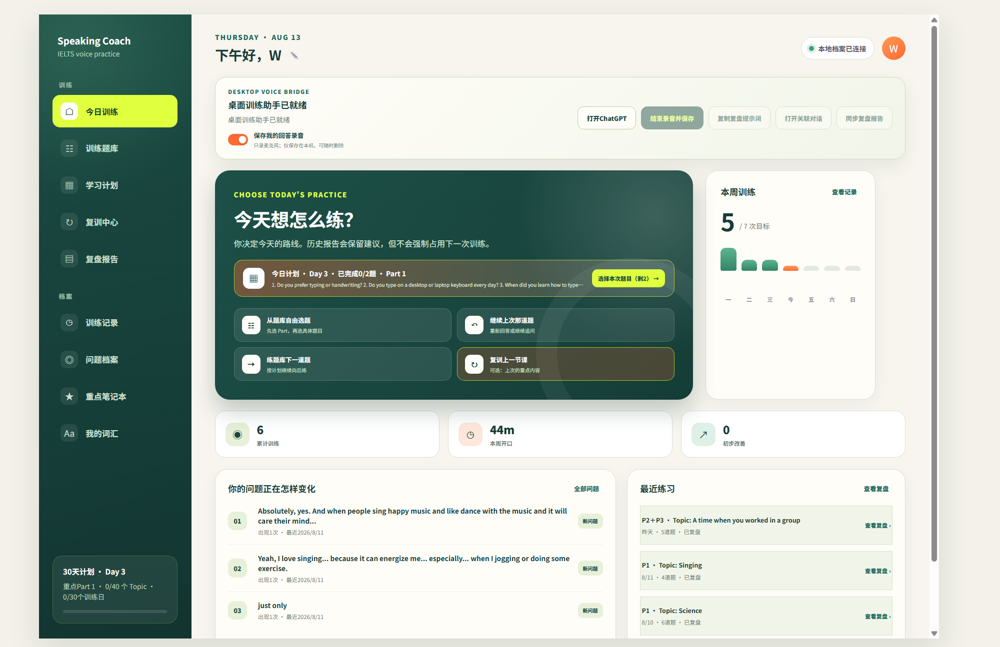
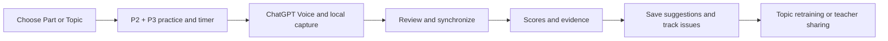
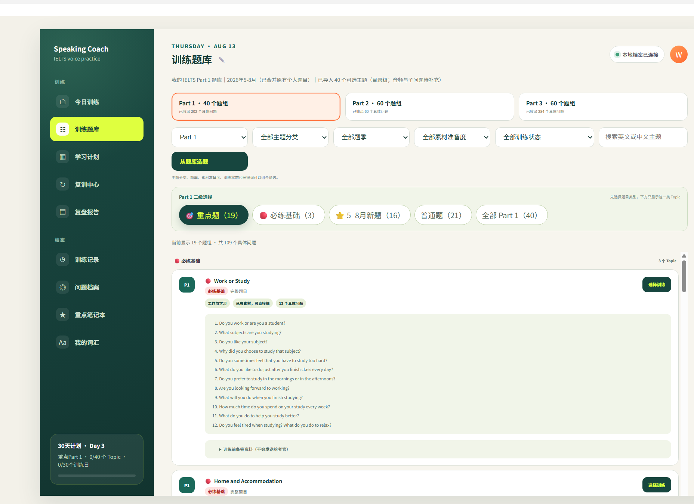
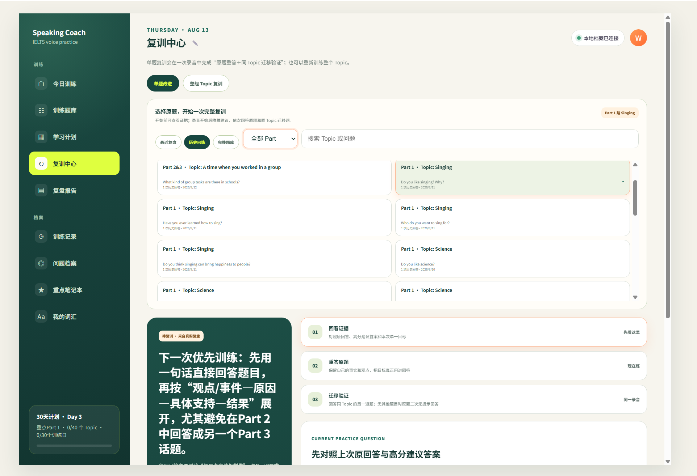
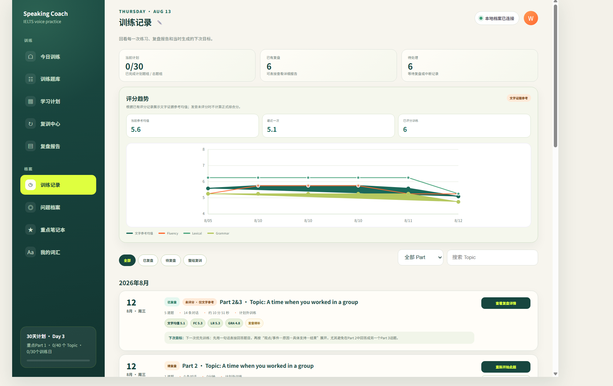
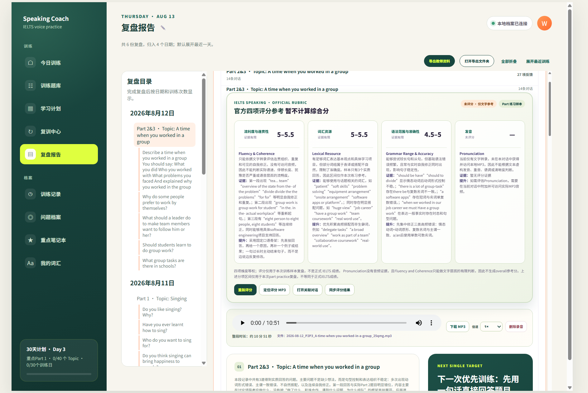
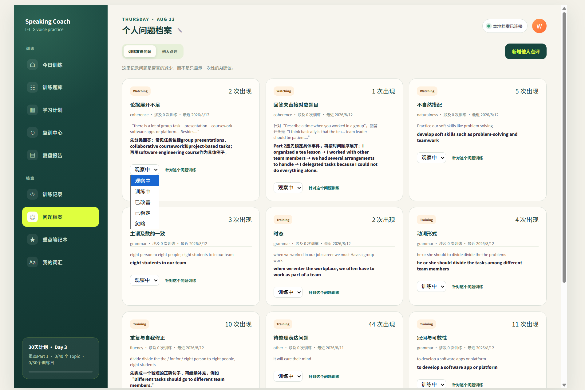
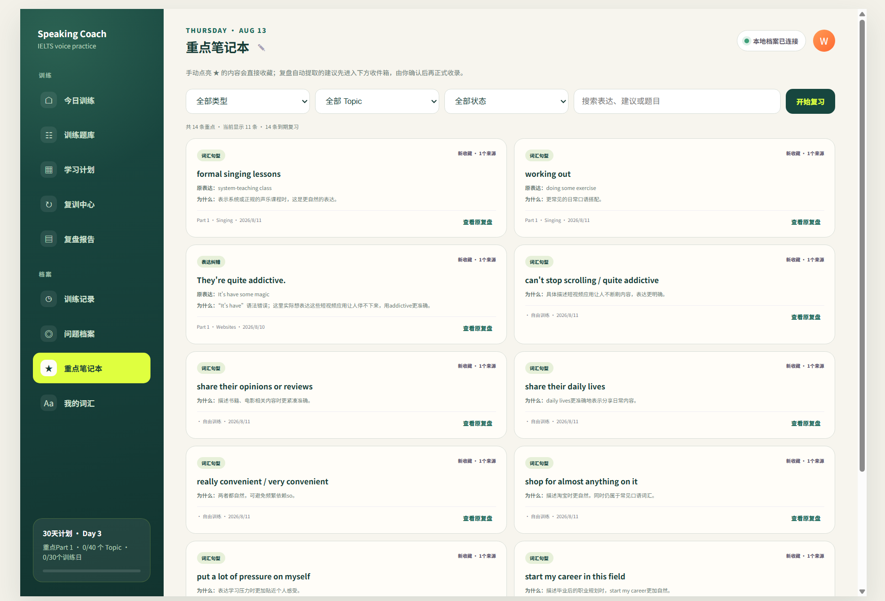
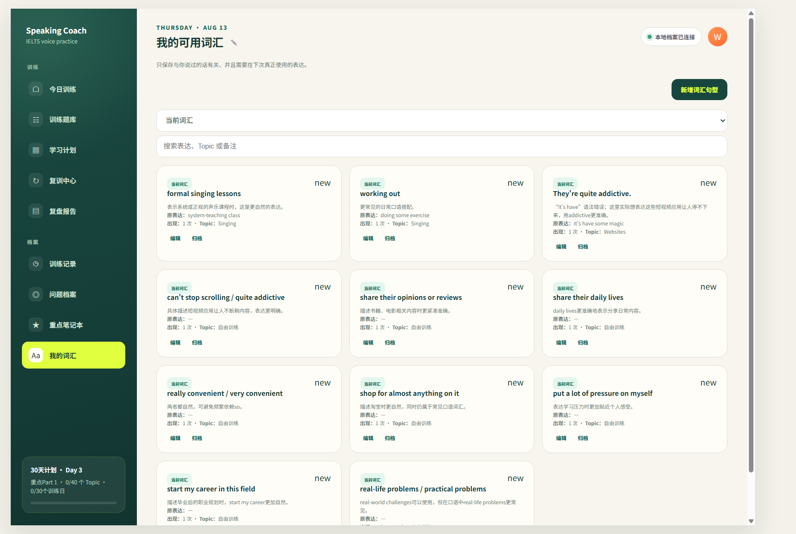
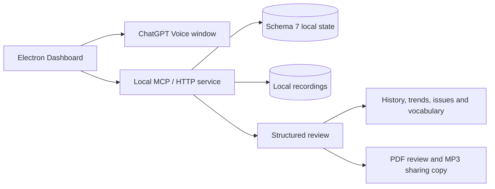

# IELTS Speaking Coach

[English](README.md) | [简体中文](README.zh-CN.md)

IELTS Speaking Coach is a local-first desktop tool for turning IELTS Speaking practice into a repeatable learning loop. It brings question selection, ChatGPT Voice sessions, timing, local transcripts and optional recordings, structured review, issue tracking and retraining into one place.

This is an early-stage project that I am developing while learning and practising IELTS Speaking myself. The screenshots show the real interface and a low-score practice stage; the score references are included to explain the UI, not to present an official IELTS result.



`Local-first` · `Electron` · `Part 1 / 2 / 3` · `P2 + P3` · `Structured review`

## How this fork evolved

This project started from the open-source [lindsey-labs/ielts-speaking-coach](https://github.com/lindsey-labs/ielts-speaking-coach) codebase and has been continuously developed and adapted through my own learning workflow. The upstream project and its MIT license remain part of the foundation.

Several gaps became clear:

- Part 2 and Part 3 could feel like separate exercises even when they belonged to one Topic.
- Prompt preparation, ChatGPT Voice, local recording, conversation linking and review synchronization could lose continuity.
- Useful AI suggestions often disappeared after a single review instead of becoming reusable notes.
- A recurring language problem was easier to see in one report than to follow across multiple sessions.
- Single-question retraining did not always preserve the context of a complete Topic.
- A recommended study-plan question could receive too much weight, even when the learner completed a different meaningful practice.
- Long review reports needed clearer navigation, folding and evidence levels.
- Scores, recordings, history and teacher sharing needed a more coherent local workflow.

The project responds by connecting the practice flow, review structure, long-term tracking and recovery states. Most of the current practice, tracking and desktop workflow is already usable, including P2 + P3 grouping, timing, ChatGPT bridge states, recording playback, history and adaptive content layouts. The review report and study-plan areas are still being refined as the local workflow becomes more stable.

## A complete practice journey



The intended journey is:

1. Choose a Part, a Topic, a planned question or a free question-bank item.
2. Practise Part 1, Part 2 or a paired Part 2 + Part 3 sequence with timing context.
3. Use the visible ChatGPT workflow to prepare, copy or send the review prompt, link the conversation and synchronize the result when ready.
4. Read structured feedback with a clear distinction between text evidence and audio evidence.
5. Save useful suggestions, follow recurring issues and keep vocabulary or expression notes.
6. Return to the same Topic for focused retraining, or prepare a daily teacher-facing package in the formal local build.

## Product walkthrough

### Home and study plan


The home flow combines today's route, a flexible study plan, recent practice and progress signals. Recommendations guide the learner, while meaningful completed practice should remain visible even when the learner chooses another question.

### Part 2 + Part 3 practice



Question-bank filters and tags make it easier to start from a Part or Topic. The current workflow keeps the Part 2 cue card and Part 3 follow-up discussion together, instead of forcing the learner to rebuild the same context manually.



The retraining center can present a complete Topic as `Part 2&3 · Topic: ...`, while still allowing a single-question improvement route when that is more useful.

### ChatGPT workflow and synchronization



The training history keeps completed and pending sessions visible together with score trends, timing and next actions. The desktop bridge provides visible states for opening ChatGPT, preparing a session, saving a recording, copying a review prompt, opening the associated conversation and synchronizing a generated review. Microphone and ChatGPT control require the Electron desktop environment and the learner's own sign-in.

### Structured review



Reports group the summary, four-dimension score reference, evidence, expression corrections, natural upgrades, habits, logic, vocabulary and answer improvements. The report view also exposes a navigation outline, collapsible sections, question-level evidence and retraining actions.

### Long-term tracking







The dashboard turns one review into reusable records: saved AI suggestions, a focused notebook, a trackable issue archive, vocabulary notes, history and progress signals. These records are local and designed to be updated as more practice provides better evidence.

### Topic retraining and teacher sharing

Topic retraining keeps the Part 2 prompt and its Part 3 discussion in one learning context. The teacher export flow is designed to turn a day's review report into a shareable PDF together with the related MP3 attachments. This makes it easier to send practice evidence to a private speaking tutor, or keep an offline package for self-review. The export is a local sharing copy: it does not move the app's official recordings and is not an online hosted service.

## Key extensions in this fork

The following areas are maintained or substantially extended by `User-Wan` in the working version of the project. The repository includes the reusable implementation and selected UI captures; recordings, state files and private exports are not included.

- Green-and-orange dashboard hierarchy, responsive layouts and clearer information density.
- Window-aware content layouts that collapse into single-column views at narrower widths and avoid horizontal clipping in the main pages.
- Part 2 + Part 3 Topic grouping on the home page and in retraining, avoiding repeated cards for one Topic.
- Part 2 / Part 3 timing context retained for review.
- A more traceable ChatGPT workflow: associated-conversation linking, manual prompt copy or send, supported automatic controls, manual synchronization and recoverable interruption states.
- Local WebM/MP3 recording management, including seekable playback, progress control, speed control and fallback handling where supported by the desktop build.
- Four-dimension score references that distinguish limited text evidence from accessible audio evidence and do not invent a pronunciation score.
- AI suggestion bookmarks and a focused notebook for reusable expressions and feedback.
- Issue records with occurrence history, status, archive controls and next actions.
- Topic-level retraining that preserves Part 2 and Part 3 context, alongside single-question improvement when that is the right next step.
- Review reports with clearer layout, navigation, collapsible areas, date and Session context, and question-level evidence.
- Question-bank tag selection, with broader Topic groups such as technology and education planned as the next organization layer.
- A flexible study-plan interpretation: recommendations guide practice; completed work is not invalidated simply because a different question was chosen.
- Non-destructive pending-session handling and soft archiving for records that need recovery or a later decision.
- Schema 7-compatible data handling and expanded MCP, desktop-flow and review-control coverage.

## Architecture



The formal build is local-first: the dashboard and local service read and write the learner's own workspace. Recordings remain in the local archive used by the app. A teacher package contains a PDF review report and copied MP3 attachments for a selected day; it is a disposable sharing copy, not a replacement for the archive. The public repository includes only the code, a small sample bank and selected UI captures.

## Privacy boundary

The public repository must not contain:

- real transcripts, reports, recordings or teacher exports;
- ChatGPT conversation URLs, login state, cookies, browser profiles or caches;
- local machine paths, personal names, tokens or other identifying data.

The demo data uses fictional names, Topics, answers and score references. Recording is optional and remains on the learner's machine. Pronunciation feedback requires accessible audio evidence; text-only samples do not justify a made-up pronunciation score.

## Getting started

Requirements:

- Node.js 20 or newer;
- Windows for the tested Electron workflow;
- a ChatGPT account for the optional Voice bridge.

```powershell
npm install
npm run desktop
```

The dashboard opens as a desktop window. Sign in to ChatGPT yourself in the separate ChatGPT window, choose a route and question, then use the visible controls to start, finish and synchronize a session. The public static dashboard can also be opened directly at [`demo/dashboard.html`](demo/dashboard.html); it uses fictional data and does not access a personal learning workspace.

On Windows, [`start-ielts-speaking-coach.cmd`](start-ielts-speaking-coach.cmd) provides a one-click launcher. It checks Node.js, installs missing dependencies and keeps the console visible when startup fails.

## Tests

Run the relevant checks before publishing a change:

```powershell
npm run test:review-parser
npm run test:answer-policy
npm run test:voice-end
npm run test:review-controls
npm run test:desktop-flow
npm run test:mcp
```

Release checks should also verify that the public fixture loads in a clean directory and that no private state, recording, browser profile, conversation URL or machine-specific path is tracked.

## Limitations and roadmap

The desktop bridge depends on the current ChatGPT web interface and may need selector updates when that interface changes. Score references are practice feedback, not official IELTS results. The current version does not support account login, cloud data transfer or mobile-device synchronization; data remains in the local workspace unless the learner exports or shares it manually.

The main areas still under active iteration are:

- clearer review-report hierarchy, evidence summaries and long-report navigation;
- a more useful study-plan view, including Topic grouping and completion summaries;
- more reliable Voice integration, manual-prompt recovery and review synchronization;
- broader question-bank organization by Topics such as technology and education;
- continued refinement of vocabulary notebooks, issue archives and tracking reports through real usage;
- continued refinement of the teacher export flow, including PDF layout, MP3 attachment handling and output-folder behavior;

The screenshots are real captures from my early-stage local learning workspace,
used to show the current UI rather than to present polished final results. The
application and its study-plan, review and tracking views are still being
iterated; future stable local versions will be added here gradually.

## Contributing

If you use the project, GitHub Issues are welcome for reproducible bugs, workflow suggestions and new use cases. Pull Requests are welcome for focused code, documentation, testing, accessibility, cross-platform support, account and sync ideas, mobile workflows and UX improvements.

Please use synthetic data in issues and pull requests. Do not attach real recordings, learner answers, login information or personal machine paths. Contributions should preserve the upstream MIT notice and keep privacy boundaries clear.

## Upstream and license

- Upstream project: [lindsey-labs/ielts-speaking-coach](https://github.com/lindsey-labs/ielts-speaking-coach)
- Maintained fork: [User-Wan/ielts-speaking-coach](https://github.com/User-Wan/ielts-speaking-coach)
- License: [MIT](LICENSE)

IELTS is a trademark of its respective owners. This independent project is not endorsed by or affiliated with the IELTS test partners. ChatGPT is a trademark of OpenAI; this project is not an official OpenAI product.
