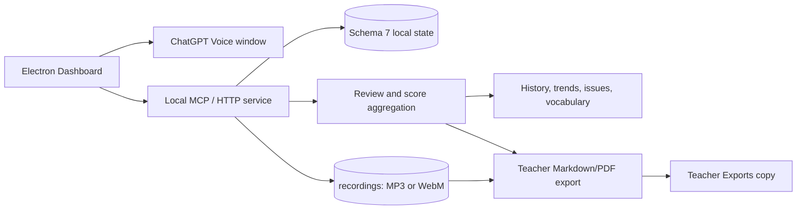

# IELTS Speaking Coach

[English](README.md) | [简体中文](README.zh-CN.md)

**IELTS Speaking Coach** is a local-first desktop workflow for structured IELTS Speaking practice, review, and targeted retraining.

This repository is a maintained fork of [lindsey-labs/ielts-speaking-coach](https://github.com/lindsey-labs/ielts-speaking-coach). The original project and its contributors are preserved in the history and license. The `User-Wan` fork adds an updated green-and-orange dashboard, a more complete local learning workflow, recording management, teacher-facing exports, and safer recovery controls.

## What it does

The app connects one practice session from start to finish:

```text
Choose Part / Topic
        ↓
ChatGPT Voice practice
        ↓
Local transcript and optional recording
        ↓
Structured AI review
        ↓
Scores, issues, vocabulary, and progress
        ↓
Targeted retraining or teacher export
```

It supports:

- Part 1, Part 2, Part 3, and full mock routes;
- paired Part 2 + Part 3 topic practice;
- 7-day, 14-day, and 30-day study plans;
- local WebM/MP3 recording storage with MP3-first playback;
- review reports, score trends, recurring issues, vocabulary, and notes;
- historical session review and focused retraining;
- Markdown/PDF daily teacher reports with optional audio attachments;
- pending-session classification and reversible soft archiving;
- a local MCP server and an Electron desktop bridge.

## Key extensions in this fork

The following areas are maintained or substantially extended by `User-Wan`:

- green-and-orange dashboard hierarchy with responsive layouts and reduced visual noise;
- P2 + P3 topic grouping in the home page and retraining center, so one Topic is not split into repeated cards;
- timed Part 2/Part 3 practice with timing context preserved for review;
- an improved ChatGPT bridge: associated-conversation linking, manual prompt copy/send, supported automatic controls, manual synchronization, and traceable recovery states;
- MP3-first playback, progress seeking, speed control, and WebM fallback;
- teacher package export with scores, transcripts, AI analysis, and audio-copy rules;
- four-dimension score references that clearly distinguish text-only evidence from audio evidence;
- collectible AI suggestions and a focused notebook for reusable language and feedback;
- trackable issue/archive records with occurrence history, status, and next actions;
- topic-level retraining that keeps Part 2 and Part 3 context together instead of treating retraining as isolated question replay;
- review reports with clearer navigation, a table of contents, collapsible sections, and question-level evidence;
- question-bank tag selection, with broader categories such as technology and education planned as the next organization layer;
- a more flexible study-plan rule: recommendations guide practice, while completed work counts even when the learner chooses a different question;
- pending-training states, next actions, and non-destructive soft archive controls;
- schema-7-compatible study-plan and report rendering safeguards;
- expanded desktop, MCP, and review-control test coverage.

## Privacy and public repository boundary

The public repository contains application code, a small sample question bank, and synthetic demonstration data only.

It does **not** contain:

- learner transcripts, reports, recordings, or teacher exports;
- ChatGPT conversation URLs, login state, cookies, browser profiles, or local caches;
- personal question-bank files, OCR output, or commercial IELTS materials;
- machine-specific paths such as `E:\\chatgpt` or user profile directories.

The desktop app stores learner data locally. Recording is optional and is never uploaded by this repository. A public demo may refer to a filename such as `sample-speaking-session.mp3`, but no audio binary is included.

IELTS is a trademark of its respective owners. This independent project is not endorsed by or affiliated with the IELTS test partners. ChatGPT is a trademark of OpenAI; this project is not an official OpenAI product.

## Architecture



The formal recording archive remains the source for playback. Teacher exports are disposable sharing copies and never replace or move the original recordings.

## Getting started

Requirements:

- Node.js 20 or newer;
- Windows for the tested Electron workflow; macOS packaging is supported by the build configuration;
- a ChatGPT account for the optional Voice bridge.

```powershell
npm install
npm run desktop
```

The dashboard opens as a desktop window. Sign in to ChatGPT yourself in the separate ChatGPT window, select a route and question, then start and end the Voice session through the visible controls. The local bridge saves structured review data only after the review is synchronized.

On Windows, you can also double-click [`start-ielts-speaking-coach.cmd`](start-ielts-speaking-coach.cmd). The launcher checks Node.js, installs missing dependencies, uses an isolated Electron runtime directory to avoid stale profile locks, and keeps the console open when startup fails.

For a static sample dashboard, open `demo/dashboard.html` directly in a browser. It uses fictional data and does not access your personal learning storage.

## Tests

Run the core checks before publishing changes:

```powershell
npm run test:review-parser
npm run test:answer-policy
npm run test:voice-end
npm run test:review-controls
npm run test:desktop-flow
npm run test:mcp
```

The release workflows also verify installer output. Private question-bank material is restored only from repository secrets during a release build; it is not committed to GitHub.

## Limitations

- The desktop bridge depends on the current ChatGPT web interface and may need selector updates when that interface changes.
- AI score references are practice feedback, not official IELTS scores.
- Pronunciation requires accessible audio evidence; text-only reviews do not invent a pronunciation score.
- This project is local-first and does not yet provide hosted multi-learner accounts or institutional administration.

## Roadmap

- stronger cross-platform validation;
- more reliable Voice integration and recovery;
- continued improvement of topic-level retraining, including clearer progress and better Part 2/Part 3 follow-up control;
- a more complete end-to-end recovery flow for manual prompt sending and review synchronization;
- clearer teacher workflows for reviewing exported daily reports;
- continued refinement of vocabulary notebooks, issue archives, and other tracking reports based on real usage;
- question-bank organization by broader Topics such as technology and education;
- optional multi-learner data separation with explicit consent and retention controls.

## Contributing

Please read [CONTRIBUTING.md](CONTRIBUTING.md). Keep learner data, recordings, credentials, private question banks, browser profiles, and generated installers out of commits. Contributions should preserve the upstream MIT notice.

## Upstream and license

- Upstream project: [lindsey-labs/ielts-speaking-coach](https://github.com/lindsey-labs/ielts-speaking-coach)
- Maintained fork: [User-Wan/ielts-speaking-coach](https://github.com/User-Wan/ielts-speaking-coach)
- License: [MIT](LICENSE)
