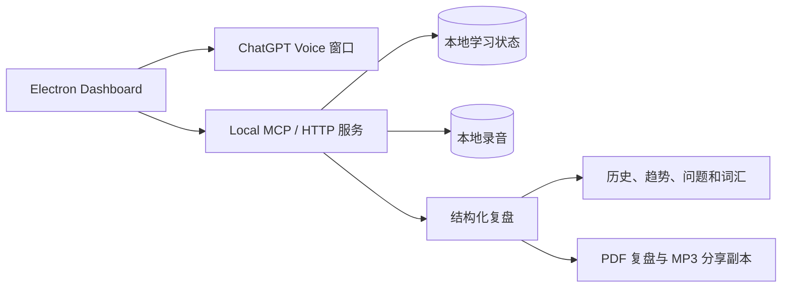

# IELTS Speaking Coach

[English](README.md) | [简体中文](README.zh-CN.md)

IELTS Speaking Coach 是一个本地优先的雅思口语桌面训练工具，把选题、ChatGPT Voice、计时、本地转写与可选录音、结构化复盘、问题追踪和复训连接成一个可以长期使用的学习闭环。

这是一个我在自己学习和练习雅思口语过程中持续开发的早期项目。截图展示的是真实界面和目前偏低的练习分数，分数只是为了说明 UI 中如何展示练习参考，不是正式 IELTS 成绩。


`Local-first` · `Electron` · `Part 1 / 2 / 3` · `P2 + P3` · `结构化复盘`

### 试用公开演示页

你可以打开[只读 GitHub Pages 演示页](https://user-wan.github.io/ielts-speaking-coach/)查看产品流程和界面。演示页只使用虚构样例数据；ChatGPT、录音、保存、同步和教师资料导出仍然属于桌面版能力，公开网页不会读取学习者本机数据。

[本地运行](#快速开始) · [查看源代码](https://github.com/User-Wan/ielts-speaking-coach)

## 这个项目怎样发展起来

这个项目基于开源的 [lindsey-labs/ielts-speaking-coach](https://github.com/lindsey-labs/ielts-speaking-coach) 代码开始，并在我自己的学习和使用过程中持续开发和调整。上游项目和 MIT 许可证仍然是基础的一部分。

在实际练习中，几个问题逐渐变得明显：Part 2 和 Part 3 容易被拆成不连续的练习；Prompt、ChatGPT Voice、录音、关联对话和复盘同步之间容易断开；AI 建议练完后不容易收藏和复用；问题记录缺少出现历史和下一步行动；单题复训难以保留完整 Topic 上下文；学习计划不应该因为选择了其他有价值的题目就简单判定为没有完成；较长的复盘报告也需要更清楚的目录、折叠和证据层级。

目前大部分训练、追踪和桌面工作流已经可以使用，包括 P2＋P3 合并、计时、ChatGPT 桥接状态、录音播放、训练历史和自适应内容布局。复盘报告和学习计划仍在继续优化，会随着本地运行更加稳定逐步调整。

## 一次完整的练习流程


理想的使用流程是：

1. 从 Part、Topic、学习计划或题库自由选择开始。
2. 进行 Part 1、Part 2，或配对的 Part 2 + Part 3 训练，并保留计时信息。
3. 使用可见的 ChatGPT 流程准备、复制或发送复盘 Prompt，关联对话，并在准备好后同步结果。
4. 阅读结构化反馈，区分文字证据和音频证据。
5. 收藏有用建议，追踪重复出现的问题，并维护词汇或表达笔记。
6. 回到同一个 Topic 做针对性复训，或在本地版本中准备教师分享资料。

## 页面展示

### 首页与学习计划


首页把今日训练、可调整的学习计划、最近练习和进度信号放在一起。推荐用于引导，完成有价值的其他训练也应该保留在记录中。

### 题库与 Part 2 + Part 3 训练


题库支持 Part、Topic、标签等筛选，帮助用户从清晰的入口开始。当前流程会把 Part 2 题卡和 Part 3 连续追问放在同一个训练上下文中，避免每次手动重新拼接。

### Topic 复训


复训中心可以把完整 Topic 显示为 `Part 2&3 · Topic: ...`，同时保留在合适时进行单题改进的入口。

### 训练记录与评分趋势


训练记录会把已完成和待处理 Session、评分趋势、计时和下一步操作放在一起。桌面桥接层提供打开 ChatGPT、准备训练、保存录音、复制复盘 Prompt、打开关联对话和同步复盘报告等可追踪状态。

### 结构化复盘


复盘页面整理总结、四项评分参考、证据、表达纠正、更自然的表达、口头习惯、逻辑、词汇和逐题回答建议。复盘报告的信息层级、目录、折叠区域和长报告导航仍在继续优化。

### 长期追踪


一次复盘可以沉淀为可复用记录：AI 建议收藏、重点笔记本、可追踪的问题档案、词汇记录、训练历史和评分趋势。随着更多练习产生证据，这些记录还会继续调整。

### Topic 复训与教师分享

Topic 复训把 Part 2 题目和 Part 3 讨论放在一个学习上下文中。教师导出流程用于把某一天的复盘报告导出为可分享的 PDF，并附上对应的 MP3 录音。这样可以把练习情况发给自己约的口语老师，也可以保存下来做离线复习和复盘。导出内容是本地分享副本，不会移动 App 使用的正式录音，也不是在线托管服务。

## 这个项目中的主要扩展

以下内容由 `User-Wan` 在工作版本中维护或进行了重要扩展。仓库保留可复用代码和经过选择的界面截图，不包含录音、状态文件或私人导出资料。

- 绿色＋橙色视觉体系、响应式布局和更清晰的信息层级；
- 内容区域会根据窗口宽度收缩，窄窗口下主要页面切换为单列，减少横向裁切；
- 首页和复训中心的 P2 + Part 3 Topic 合并显示，避免同一个 Topic 被拆成重复卡片；
- Part 2 / Part 3 训练计时，并在复盘中保留对应的训练时间信息；
- 更完整、可追踪的 ChatGPT 流程：关联对话、手动复制或发送 Prompt、支持时使用自动控制、手动同步和可恢复的中断状态；
- 本地 WebM/MP3 录音管理，桌面版本支持进度拖动、倍速播放和回退处理；
- 区分文字证据和音频证据的四项评分参考，不虚构发音分数；
- AI 建议收藏和重点笔记本，用于保存可复用的表达与反馈；
- 带有出现历史、状态、归档控制和下一步行动的问题档案；
- 保留完整 Part 2 与 Part 3 上下文的 Topic 级复训，同时提供适合单题改进的入口；
- 题库标签选择，以及后续按科技、教育等更大 Topic 分类的方向；
- 学习计划以推荐作为引导，完成训练即可计入，不因选择其他题目就否定实际完成情况；
- 待处理训练状态、下一步操作和非破坏性软归档；
- 与现有 schema 兼容的本地数据处理，以及 MCP、桌面流程和复盘控制测试。

## 技术结构



项目采用本地优先设计：仪表盘和本地服务读写用户自己的工作区；录音保存在 App 使用的本地档案中；教师资料包包含选定日期的 PDF 复盘报告和 MP3 附件，是方便分享或自我复习的副本，不会替代或移动正式录音。公开仓库只包含代码、精选截图和公开演示所需的内容。

## 隐私边界

公开仓库不应包含：

- 真实转写、复盘报告、录音或教师导出包；
- ChatGPT 对话地址、登录状态、Cookie、浏览器 Profile 或缓存；
- 本机路径、个人姓名、Token 或其他可识别信息。

截图来自我早期学习阶段的真实本地使用情况，主要用于展示 UI。录音是可选项，只保存在学习者自己的电脑中。发音反馈需要可访问的音频证据；只有文字时不应虚构发音评分。

## 快速开始

环境要求：

- Node.js 20 或更高版本；
- 当前已测试的 Electron 流程需要 Windows；
- 使用 ChatGPT Voice 桥接时需要用户自己的 ChatGPT 账号。

```powershell
npm install
npm run desktop
```

仪表盘会以桌面窗口打开。请在独立的 ChatGPT 窗口中自行登录，然后选择训练路线和题目，再使用界面按钮开始、结束和同步训练。也可以直接打开 [`demo/dashboard.html`](demo/dashboard.html) 查看静态示例；它使用演示数据，不读取个人学习档案。

Windows 下也可以双击 [`start-ielts-speaking-coach.cmd`](start-ielts-speaking-coach.cmd) 启动。

如果想在本机查看与公开网页相同的虚构样例数据，可以双击 [`start-ielts-speaking-coach-demo.cmd`](start-ielts-speaking-coach-demo.cmd)。它会使用 [`demo/sample-data.json`](demo/sample-data.json) 构建一个独立的只读 Demo，并在 `43129` 端口打开；不会读取或写入私人 `state.json`。真正进行训练时仍使用普通启动脚本。

## 测试

发布改动前运行相关检查：

```powershell
npm run test:review-parser
npm run test:answer-policy
npm run test:voice-end
npm run test:review-controls
npm run test:desktop-flow
npm run test:mcp
```

还应在干净目录确认公开示例可以加载，并检查 Git 跟踪文件中没有私人状态、录音、浏览器 Profile、对话地址或本机路径。

## 限制与后续计划

桌面桥接依赖 ChatGPT 当前网页界面，页面结构变化时可能需要更新选择器。评分参考只用于练习复盘，不是正式 IELTS 成绩。当前版本不支持账号登录、云端数据转存或手机端同步；数据默认保存在本地工作区，只有在学习者主动导出或分享时才会离开本机。

目前仍在继续优化的重点是：

- 复盘报告的信息层级、证据摘要和长报告导航；
- 学习计划页面，包括 Topic 聚合和完成情况总结；
- 更稳定的 Voice 集成、手动 Prompt 恢复和复盘同步；
- 按科技、教育等更大的 Topic 组织题库；
- 根据更多使用情况持续优化词汇笔记本、问题档案和其他追踪报告；
- 持续优化教师导出流程，包括 PDF 排版、MP3 附件处理和输出目录行为；

## 参与改进

如果你实际使用了这个项目，欢迎通过 GitHub Issues 反馈可复现的问题、工作流建议和新的使用场景。也欢迎通过 Pull Requests 改进代码、文档、测试、无障碍、跨平台支持、账号与同步方向、移动端工作流和交互体验。

Issues 和 PR 请使用合成数据，不要附加真实录音、学习者回答、登录信息或个人电脑路径。贡献内容也应保留上游 MIT 声明并继续遵守隐私边界。

## 上游与许可

- 上游项目：[lindsey-labs/ielts-speaking-coach](https://github.com/lindsey-labs/ielts-speaking-coach)
- 当前项目：[User-Wan/ielts-speaking-coach](https://github.com/User-Wan/ielts-speaking-coach)
- 许可证：[MIT](LICENSE)

IELTS 是其相关权利方的商标。本独立项目不代表或隶属于 IELTS 考试合作机构。ChatGPT 是 OpenAI 的商标；本项目不是 OpenAI 官方产品。
