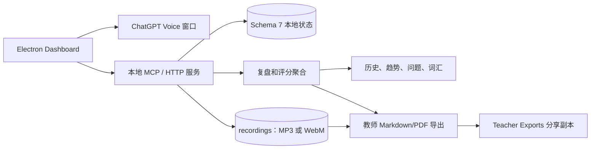

# IELTS Speaking Coach

[English](README.md) | [简体中文](README.zh-CN.md)

**IELTS Speaking Coach** 是一个本地优先的雅思口语桌面训练工作流，用于完成练习、复盘、针对性复训和教师资料导出。

本项目是 [lindsey-labs/ielts-speaking-coach](https://github.com/lindsey-labs/ielts-speaking-coach) 的维护 fork。上游项目及其贡献者、历史和许可证均予以保留。`User-Wan` 在此基础上维护了新的绿色＋橙色仪表盘、本地学习闭环、录音管理、教师导出和更安全的恢复控制。

## 功能概览

应用把一次训练连接成完整闭环：

```text
选择 Part / Topic
        ↓
ChatGPT Voice 练习
        ↓
本地转写和可选录音
        ↓
结构化 AI 复盘
        ↓
评分、问题、词汇和进度
        ↓
针对性复训或教师导出
```

支持：

- Part 1、Part 2、Part 3 和完整模考入口；
- Part 2 + Part 3 配对话题训练；
- 7 天、14 天和 30 天学习计划；
- WebM/MP3 本地录音，MP3 优先播放；
- 复盘报告、评分趋势、重复问题、词汇和重点笔记；
- 历史 Session 指定复盘和重点目标复训；
- 包含评分、转写、AI 分析和可选录音附件的 Markdown/PDF 教师日报；
- 待处理训练分类和可撤销的软归档；
- 本地 MCP 服务和 Electron 桌面桥接。

## 本 fork 的主要扩展

以下内容由 `User-Wan` 维护或进行了重要扩展：

- 绿色＋橙色视觉体系、响应式布局和更清晰的信息层级；
- 首页与复训中心的 P2 + P3 Topic 合并显示，避免同一个 Topic 被拆成重复卡片；
- Part 2 / Part 3 训练计时，并在复盘中保留对应的训练时间信息；
- 更完整的 ChatGPT 桥接流程：关联对话、手动复制/发送 prompt、在支持时使用自动控制、手动同步，以及可追踪的异常恢复状态；
- MP3 优先播放、进度拖动、倍速播放和 WebM 回退；
- 教师资料包导出，以及评分、转写、AI 分析和录音复制规则；
- 明确区分文字证据和音频证据的四项评分参考；
- AI 建议收藏和重点笔记本，用于保存可复用表达与反馈；
- 可追踪的问题档案与软归档，记录出现历史、处理状态和下一步行动；
- 从单题复训扩展到 Topic 级复训，保留 Part 2 题目和对应 Part 3 追问的上下文；
- 复盘报告布局优化，包括目录、可折叠区块、日期/Session 导航和逐题证据；
- 题库支持标签选择，后续计划按科技、教育等更大的 Topic 分类整理；
- 学习计划从“必须完成系统推荐题目”调整为“推荐作为引导、完成训练即可计入”，不再因为选择其他题目而不计入完成情况；
- 待处理训练的状态、下一步操作和非破坏性软归档；
- 与 schema 7 兼容的学习计划和复盘渲染保护；
- 更完整的桌面、MCP 和复盘控制测试。

## 隐私和公开边界

公开仓库只包含应用代码、小型示例题库和虚构演示数据。

不会包含：

- 学习者的转写、复盘报告、录音或教师导出包；
- ChatGPT 对话地址、登录状态、Cookie、浏览器 Profile 或缓存；
- 个人题库、OCR 文件或商业雅思材料；
- `E:\\chatgpt` 或用户目录等本机绝对路径。

桌面应用把学习数据保存在本地。录音功能是可选的，本仓库不会上传录音。公开示例可以提到 `sample-speaking-session.mp3` 这样的虚构附件名，但不提供音频二进制文件。

IELTS 是其相关权利方的商标。本独立项目不代表 IELTS 官方，也不与 IELTS 考试合作方存在官方关联。ChatGPT 是 OpenAI 的商标，本项目不是 OpenAI 官方产品。

## 架构



正式录音目录始终是播放器的数据源。教师导出目录只是可删除、可重新生成的分享副本，不会替换或移动原始录音。

## 快速开始

环境要求：

- Node.js 20 或更高版本；
- Windows 用于已测试的 Electron 工作流；macOS 打包配置也已保留；
- 使用 Voice 桥接时需要 ChatGPT 账号。

```powershell
npm install
npm run desktop
```

应用会打开桌面窗口。请在独立的 ChatGPT 窗口中自行登录，选择训练入口和题目，再通过界面按钮开始和结束 Voice 训练。只有在复盘同步后，本地桥接才会保存结构化复盘数据。

Windows 用户也可以双击 [`start-ielts-speaking-coach.cmd`](start-ielts-speaking-coach.cmd) 启动。启动器会检查 Node.js、自动安装缺少的依赖，并使用独立的 Electron 运行目录减少旧用户数据锁和启动冲突；如果启动失败，命令窗口会保留错误信息。

也可以直接打开 `demo/dashboard.html` 查看静态示例页面。示例使用虚构数据，不会访问你的个人学习目录。

## 测试

发布修改前运行：

```powershell
npm run test:review-parser
npm run test:answer-policy
npm run test:voice-end
npm run test:review-controls
npm run test:desktop-flow
npm run test:mcp
```

发布工作流也会验证安装包。私人题库只在发布构建过程中从仓库 Secrets 恢复，不提交到 GitHub。

## 当前限制

- 桌面桥接依赖 ChatGPT 当前网页结构，网页变化后可能需要更新选择器；
- AI 分数是训练反馈，不是官方 IELTS 成绩；
- 只有在能够访问音频证据时才评估发音，文字复盘不会虚构发音分数；
- 当前采用本地优先架构，暂不提供托管式多学习者账号和机构管理后台。

## 后续路线

- 加强跨平台验证；
- 提高 Voice 集成和异常恢复稳定性；
- 继续优化 Topic 级复训，包括更清晰的进度展示和 Part 2 / Part 3 追问控制；
- 完善手动发送 prompt、复盘同步和异常恢复的端到端流程；
- 完善教师查看每日导出报告的工作流；
- 在更多实际使用中继续优化词汇笔记本、问题档案和其他追踪报告；
- 按科技、教育等更大 Topic 继续完善题库组织；
- 在明确同意和保留期限控制下，探索多学习者数据隔离。

## 参与贡献

请先阅读 [CONTRIBUTING.zh-CN.md](CONTRIBUTING.zh-CN.md)。不要把学习数据、录音、凭据、私人题库、浏览器 Profile 或安装包提交到仓库。贡献需要保留上游 MIT 声明。

## 上游和许可证

- 上游项目：[lindsey-labs/ielts-speaking-coach](https://github.com/lindsey-labs/ielts-speaking-coach)
- 维护 fork：[User-Wan/ielts-speaking-coach](https://github.com/User-Wan/ielts-speaking-coach)
- 许可证：[MIT](LICENSE)
